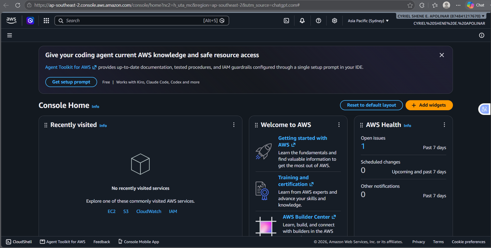

# AWS Research

## What is AWS?

Amazon Web Services (AWS) is a cloud computing platform provided by Amazon. It offers different cloud services that allow users and organizations to build, deploy, and manage applications and infrastructure over the internet.

## Why is AWS Important?

AWS is important because it provides scalable, flexible, and reliable cloud computing resources. Instead of purchasing and maintaining physical servers, organizations can use AWS services based on their needs.

## Global Infrastructure

AWS operates a global cloud infrastructure organized into Regions and Availability Zones. AWS Regions are separate geographic areas, while Availability Zones are isolated locations within a Region. This infrastructure helps organizations deploy applications closer to users and improve availability and reliability.

## AWS Cloud Management Console

The AWS Management Console is a web-based interface used to manage AWS services and resources. It allows users to create and configure resources such as EC2 instances, S3 storage, databases, networking services, and security settings.

## Four Core AWS Services

### 1. Amazon EC2

Amazon Elastic Compute Cloud (EC2) provides virtual servers that can be used to run applications and websites.

### 2. Amazon S3

Amazon Simple Storage Service (S3) is a cloud storage service used to store and retrieve files and other types of data.

### 3. Amazon RDS

Amazon Relational Database Service (RDS) makes it easier to set up, operate, and manage relational databases in the cloud.

### 4. AWS Lambda

AWS Lambda allows users to run code without managing servers. It is commonly used for event-driven applications.

## Three Advantages of AWS

1. **Scalability** – AWS resources can be increased or decreased based on application demand.
2. **Wide Range of Services** – AWS provides services for computing, storage, databases, networking, security, analytics, and application development.
3. **Global Availability** – AWS provides global infrastructure that helps organizations deploy applications in different geographic locations.

## Typical Enterprise Use Cases

AWS is commonly used by enterprises for:

* Web and application hosting
* Data storage and backup
* Database management
* Business analytics
* Disaster recovery
* Serverless application development
* Scalable e-commerce platforms

## AWS in Multi-Cloud Computing

AWS can be used together with other cloud providers such as Microsoft Azure and Google Cloud Platform. Using multiple cloud providers can help organizations avoid depending on only one provider and can allow them to choose different services based on their requirements.

## Screenshot Evidence

### AWS Official Homepage

## Conclusion

AWS is one of the major cloud computing platforms available today. Its wide range of services makes it useful for applications, data storage, databases, computing, and other cloud-based solutions. Understanding AWS is important when studying multi-cloud environments because it provides one of the major platforms used in modern cloud computing.
