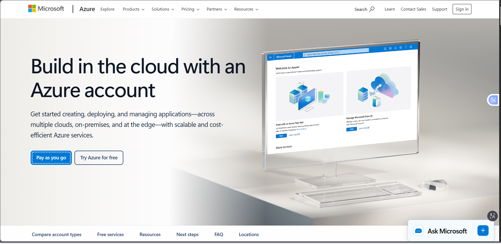

# Microsoft Azure Research

## What is Microsoft Azure?

Microsoft Azure is a cloud computing platform provided by Microsoft. It offers cloud services for computing, storage, databases, networking, security, analytics, artificial intelligence, and application development.

## Why is Azure Important?

Azure is important because it provides scalable and flexible cloud infrastructure for organizations. It is especially useful for businesses that already use Microsoft technologies and want to extend their existing systems to the cloud.

## Global Infrastructure

Microsoft Azure operates a global cloud infrastructure consisting of regions and availability zones. Azure regions are geographic areas containing one or more data centers, while availability zones provide additional protection against infrastructure failures. This global infrastructure helps organizations deploy applications closer to their users and improve reliability.

## Azure Cloud Management Console

The Azure portal is a web-based management interface used to create, configure, monitor, and manage Azure resources. Administrators and developers can use the portal to manage virtual machines, storage, databases, networking, security, and other cloud services.

## Four Core Azure Services

### 1. Azure Virtual Machines

Azure Virtual Machines provide scalable virtual servers that can run Windows or Linux operating systems and host applications and workloads.

### 2. Azure Blob Storage

Azure Blob Storage is an object storage service designed to store large amounts of unstructured data such as documents, images, videos, and backups.

### 3. Azure SQL Database

Azure SQL Database is a fully managed relational database service based on Microsoft SQL Server technology. It provides scalable and highly available database capabilities.

### 4. Azure Functions

Azure Functions is a serverless computing service that allows developers to execute code in response to events without managing the underlying servers.

## Three Advantages of Azure

1. **Microsoft Integration** – Azure integrates well with Microsoft technologies such as Windows Server, Microsoft 365, and Active Directory.
2. **Scalability** – Azure resources can be scaled according to application and business requirements.
3. **Enterprise Capabilities** – Azure provides services and security features designed to support large organizations and enterprise workloads.

## Typical Enterprise Use Cases

Microsoft Azure is commonly used by enterprises for:

- Windows and Linux application hosting
- Microsoft application integration
- Database management
- Backup and disaster recovery
- Enterprise application development
- Data analytics
- Artificial intelligence and machine learning

## Azure in Multi-Cloud Computing

Azure can be used together with AWS and Google Cloud Platform as part of a multi-cloud strategy. Organizations can select different cloud providers based on workload requirements, existing technologies, cost, performance, and business objectives.

## Screenshot Evidence

### Microsoft Azure Official Homepage

## Conclusion

Microsoft Azure is a major cloud computing platform that provides a wide range of services for organizations of different sizes. Its strong integration with Microsoft technologies makes it particularly useful for enterprises already using Windows Server, Microsoft 365, and Active Directory. Understanding Azure is important when evaluating cloud platforms and designing multi-cloud solutions.
