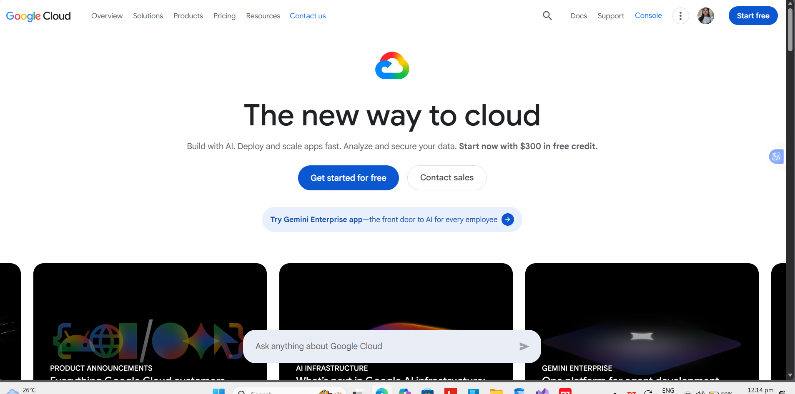

# Google Cloud Platform Research

## What is Google Cloud Platform?

Google Cloud Platform (GCP) is a cloud computing platform provided by Google. It offers cloud-based services for computing, storage, databases, networking, artificial intelligence, and application development.# Google Cloud Platform Research

## What is Google Cloud Platform?

Google Cloud Platform (GCP) is a cloud computing platform provided by Google. It offers cloud-based services for computing, storage, databases, networking, artificial intelligence, machine learning, data analytics, and application development.

## Why is GCP Important?

GCP is important because it provides scalable and flexible cloud infrastructure using Google's global network. It allows organizations and developers to build, deploy, and manage applications and services without maintaining traditional physical infrastructure.

## Global Infrastructure

Google Cloud operates a global infrastructure consisting of regions and zones. Regions are geographic locations where Google Cloud resources can be deployed, while zones are isolated locations within a region. This infrastructure helps improve application availability, performance, and reliability.

## Google Cloud Management Console

The Google Cloud Console is a web-based management interface used to create, configure, monitor, and manage Google Cloud resources. Users can manage virtual machines, storage, databases, networking, security, analytics, and other cloud services through the console.

## Four Core GCP Services

### 1. Compute Engine

Google Compute Engine provides virtual machines that can be used to run applications, websites, and other workloads in the cloud.

### 2. Cloud Storage

Google Cloud Storage is an object storage service used to store and access files, backups, media, and other types of data.

### 3. Cloud SQL

Cloud SQL is a fully managed relational database service that supports database systems such as MySQL, PostgreSQL, and SQL Server.

### 4. Cloud Functions

Google Cloud Functions is a serverless computing service that allows developers to execute code in response to events without managing servers.

## Three Advantages of GCP

1. **Strong Data and Analytics Capabilities** – GCP provides powerful services for processing, storing, and analyzing large amounts of data.
2. **Artificial Intelligence and Machine Learning** – Google Cloud provides services and tools for developing and deploying AI and machine learning applications.
3. **Global Network** – GCP uses Google's global infrastructure and network to support scalable and reliable cloud applications.

## Typical Enterprise Use Cases

Google Cloud Platform is commonly used by enterprises for:

- Web and application hosting
- Data analytics and processing
- Artificial intelligence and machine learning
- Big data workloads
- Database management
- Containerized application deployment
- Backup and disaster recovery

## GCP in Multi-Cloud Computing

GCP can be used together with AWS and Microsoft Azure as part of a multi-cloud strategy. Organizations can select different providers based on workload requirements, technical capabilities, cost, performance, and business goals.

## Screenshot Evidence

### Google Cloud Official Homepage

## Conclusion

Google Cloud Platform is a major cloud computing provider with services for computing, storage, databases, networking, analytics, artificial intelligence, and application development. Its strengths in data analytics, AI, machine learning, and cloud-native technologies make it an important platform to consider when evaluating multi-cloud environments.

## Why is GCP Important?

GCP is important because it provides organizations and developers with flexible and scalable cloud infrastructure. It allows applications and services to run using Google's global cloud infrastructure.

## Common GCP Services

### Compute Engine

Google Compute Engine provides virtual machines that can be used to run applications and workloads in the cloud.

### Cloud Storage

Google Cloud Storage is an object storage service used to store and access files and other types of data.

### Cloud SQL

Cloud SQL is a managed relational database service that supports databases such as MySQL, PostgreSQL, and SQL Server.

### Cloud Functions

Google Cloud Functions is a serverless service that allows developers to execute code in response to events without managing servers.

## Advantages of GCP

- Scalable cloud infrastructure
- Global network and data centers
- Flexible computing resources
- Managed database services
- Serverless computing options
- Strong support for data analytics and artificial intelligence

## GCP in Multi-Cloud Computing

GCP can be used together with other cloud providers such as AWS and Microsoft Azure. A multi-cloud strategy allows organizations to use services from multiple providers and select the platform that best fits a particular workload.

## Conclusion

Google Cloud Platform is a major cloud computing provider with services for computing, storage, databases, networking, analytics, and application development. Learning about GCP is useful for understanding multi-cloud environments because it is one of the major cloud platforms used in modern computing.
## GCP Global Infrastructure

Google Cloud operates a global infrastructure consisting of regions and zones around the world. A region is a geographic area that contains multiple zones, while zones are isolated locations within a region. This infrastructure helps organizations deploy applications closer to their users and improve availability and reliability.

## Google Cloud Console

The Google Cloud Console is the web-based interface used to manage Google Cloud resources and services. Users can create and manage virtual machines, storage buckets, databases, networking resources, APIs, and other cloud services through the console.

## GCP Enterprise Use Cases

GCP can be used by enterprises for different workloads, including:

- Data analytics and business intelligence
- Artificial intelligence and machine learning
- Application hosting and modernization
- Big data processing
- Website and API hosting
- Backup and disaster recovery
- Containerized application deployment

## GCP Console Screenshot / Evidence

A screenshot of the Google Cloud Console should be included here as evidence of the cloud platform and its available services.

**Screenshot:** Google Cloud Console showing the GCP dashboard or available cloud services.
